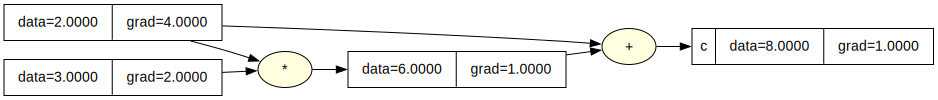

# Oxigrad

`oxigrad` is a tiny Rust implementation of automatic differentiation inspired by Andrej Karpathy's [micrograd](https://github.com/karpathy/micrograd).

It builds scalar computation graphs, tracks operations between values, and computes gradients using reverse-mode backpropagation. On top of that, it includes simple neural-network primitives like `Neuron`, `Layer`, and `MLP` so you can train a small multilayer perceptron from scratch.


## What it does

This project lets you:

- Create scalar values with `Value::new(...)`
- Combine values using operations like `+`, `-`, `*`, `pow`, `relu`, and `tanh`
- Build a computation graph automatically as operations are performed
- Call `backward()` on the final value to compute gradients
- Train a small neural network using manual gradient descent
- Visualize computation graphs as Graphviz `.dot` and `.svg` files

## Example

```rust
use oxigrad::Value;

fn main() {
    let a = Value::new(2.0);
    let b = Value::new(3.0);

    let c = a.clone() * b.clone() + a.clone();

    c.backward();

    println!("c = {}", c.data());
    println!("dc/da = {}", a.grad());
    println!("dc/db = {}", b.grad());
}
```


For this expression:

```text
c = a * b + a
```

with `a = 2` and `b = 3`, the output value is `8`. After calling `backward()`, the gradients are:

```text
dc/da = 4
dc/db = 2
```

## Neural Network Demo

The project also includes a small demo in `src/main.rs` that trains an MLP on a tiny toy dataset:

```bash
cargo run
```

During training, it prints the loss at each epoch and then renders the final computation graph to:

```text
graph.dot
graph.svg
```


If Graphviz is installed, the SVG is generated automatically.

## Project Structure

```text
src/
├── lib.rs
├── main.rs
├── micrograd/
│   ├── engine.rs   # Value type and autodiff engine
│   └── nn.rs       # Neuron, Layer, and MLP
└── graphiz/
    └── visualize.rs # Graphviz rendering
```

## Running

```bash
cargo run
```

## Checking

```bash
cargo check
```
